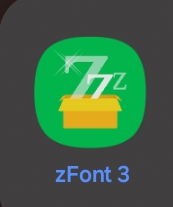
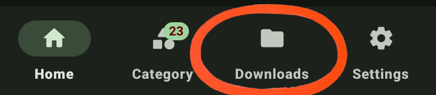
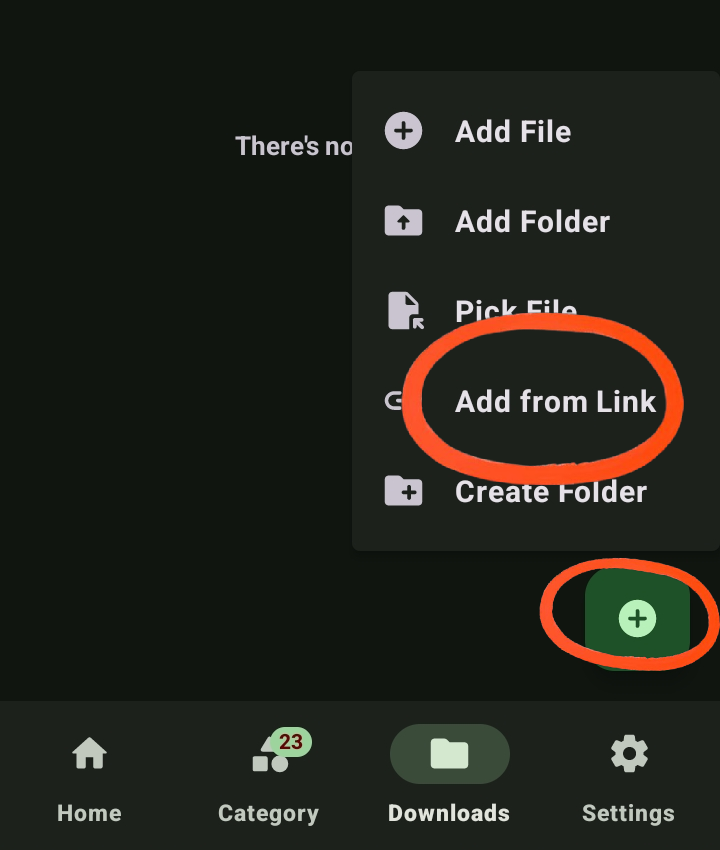
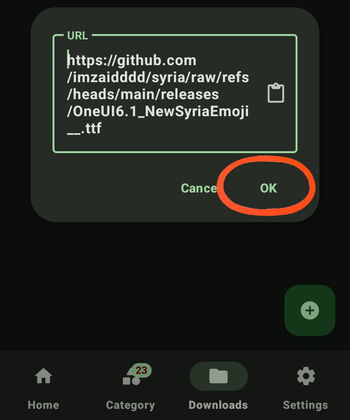
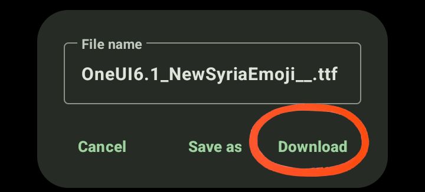
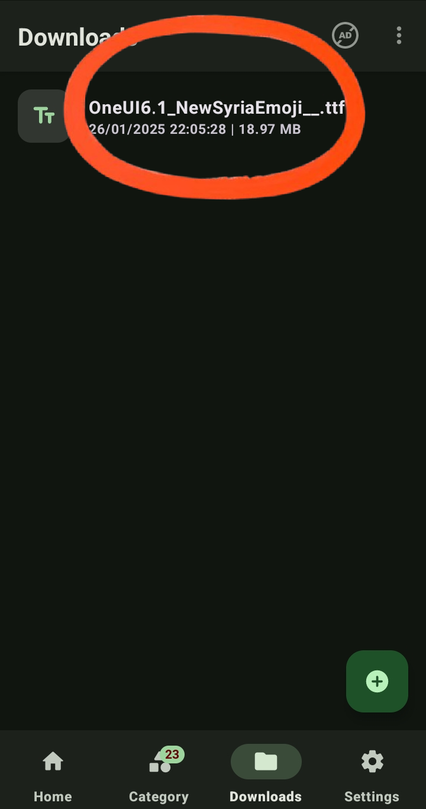
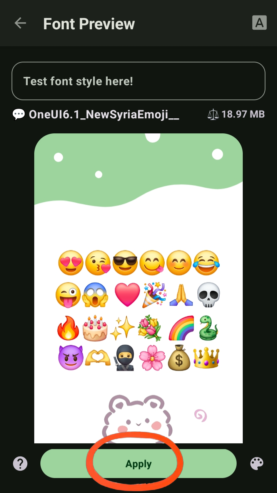
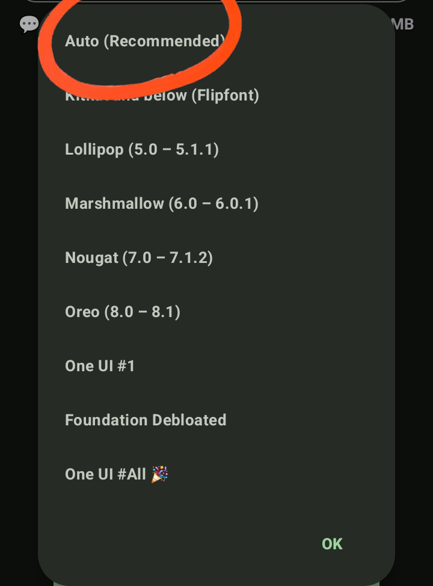
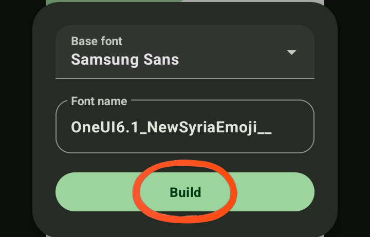
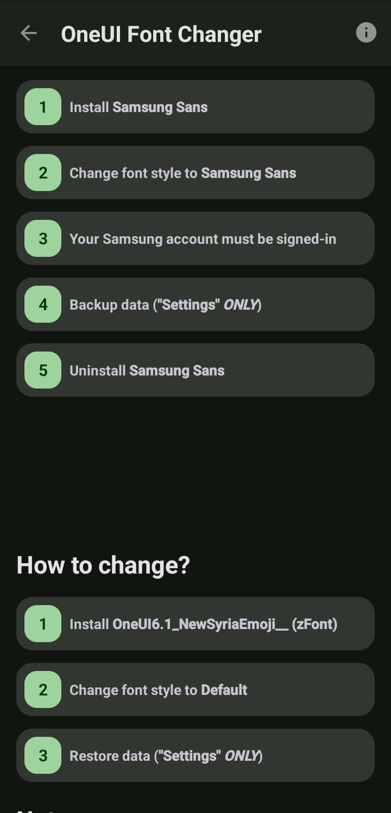

# How to change your phone syrian flag emoji to the new syrian emoji! 

## Made By Zaid S.   |   [My Website](https://www.za1d.site) , [My Linktree](https://linktr.ee/imza1d) 

## Video Tutorial Soon!!

## Step 1 (Installation Requirements)

### [ZFont3](https://play.google.com/store/apps/details?id=com.htetznaing.zfont2) 

### [ZFile Manager](https://play.google.com/store/apps/details?id=com.htetznaing.zfile) 


## Step 2

### Open the Zfont3 App


## Step 3

### Click on Downloads from the bottom


## Step 4

### Click on the + button on the bottom right corner then click Add from link


## Step 5

### Paste this link to the URL Box and then click OK
```
https://github.com/imzaidddd/syria/raw/refs/heads/main/releases/OneUI6.1_NewSyriaEmoji__.ttf
```


## Step 6

### Click on Download to begin downloading the Syria Flag Emoji


## Step 7

### After finished downloading, go back to the downloads section and click on:
```
OneUI6.1_NewSyriaEmoji__.ttf
```


## Step 8

### Click on Apply



## Step 9

### Click on:
```
Auto (Recommended)
```



## Step 10

### Click on Build



## Last Steps

### Complete the guide on the screen to finish installing the Syria Flag Emoji, you may need to give zFile Manager Permissions in the process! 

### Click on each step to do it!




# You may need to restart your device after the process to take action! 


